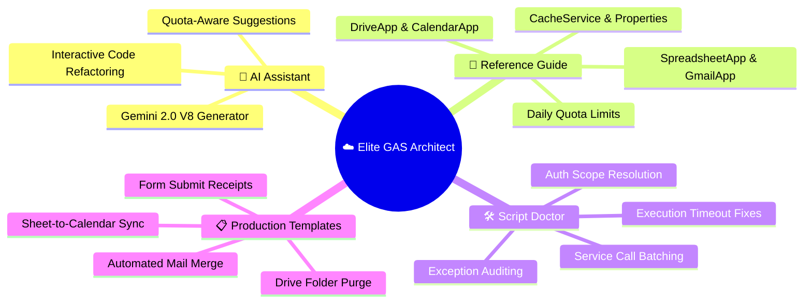
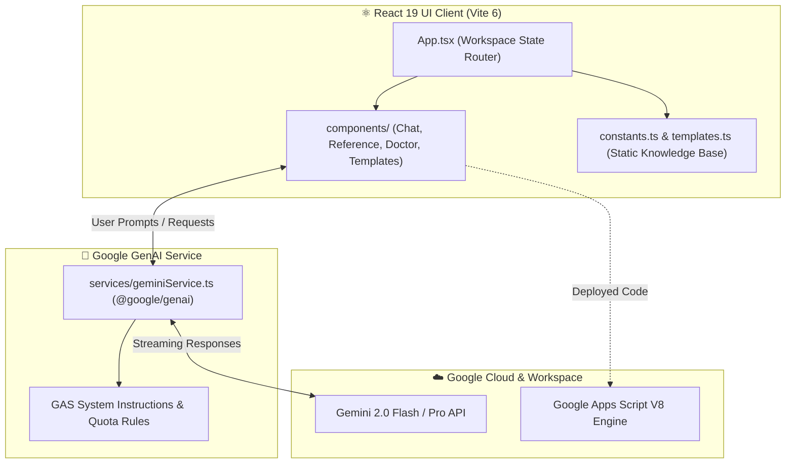

<!-- ☁️ ELITE GAS ARCHITECT — REPOSITORY PRESENTATION (L3 SHOWCASE) -->

<div align="center">


# **☁️ Elite GAS Architect**

**An AI-powered developer console, code generator, and troubleshooting engine for Google Apps Script (V8) and Google Workspace automation.**

[](#-core-workspaces)
[](package.json)
[](tsconfig.json)
[](vite.config.ts)
[](package.json)
[](https://developers.google.com/apps-script)
[](LICENSE)
[](https://github.com/traikdude/Elite-GAS-Architect)

<p align="center">
  <a href="#-overview"><b>Overview</b></a> •
  <a href="#-core-workspaces"><b>Workspaces</b></a> •
  <a href="#-production-script-templates"><b>Templates</b></a> •
  <a href="#-script-doctor--troubleshooting"><b>Script Doctor</b></a> •
  <a href="#-architecture--data-flow"><b>Architecture</b></a> •
  <a href="#-quick-start--local-development"><b>Quick Start</b></a> •
  <a href="#-contributing"><b>Contributing</b></a> •
  <a href="#-license"><b>License</b></a>
</p>

</div>

---

## 📑 Table of Contents

- [✨ Overview](#-overview)
- [🖥️ Core Workspaces](#-core-workspaces)
  - [💬 1. AI Assistant & Code Generator](#1-ai-assistant--code-generator)
  - [📖 2. Workspace Reference Guide](#2-workspace-reference-guide)
  - [🛠️ 3. Script Doctor & Troubleshooting](#3-script-doctor--troubleshooting)
  - [📋 4. Production Script Templates](#4-production-script-templates)
- [📊 Master Automation Dashboard Generator](#-master-automation-dashboard-generator)
- [🏗️ Architecture & Data Flow](#-architecture--data-flow)
- [🛠️ Tech Stack](#-tech-stack)
- [⚡ Quick Start & Local Development](#-quick-start--local-development)
- [🗂️ Repository Structure](#-repository-structure)
- [🤝 Contributing](#-contributing)
- [📄 License](#-license)

---

## ✨ Overview

**Elite GAS Architect** is a dedicated developer console and automation laboratory built for architects and engineers working within the Google Workspace ecosystem.

It combines an AI-powered conversational code generator (leveraging **Google Gemini 2.0 Flash / Pro** via `@google/genai`) with an exhaustive Google Apps Script reference library, quota monitoring guidelines, and battle-tested production templates.

Whether you are building complex Gmail mail merges, automating multi-tab spreadsheet reconciliations, creating custom webhook handlers, or diagnosing elusive Apps Script execution errors, Elite GAS Architect streamlines the entire development and deployment lifecycle.

---

## 🖥️ Core Workspaces



### 1. AI Assistant & Code Generator
Conversational AI mentor powered by `@google/genai`. Formulates production-ready Google Apps Script functions with proper error handling, logging (`Logger.log` / `console.log`), and batching strategies.

### 2. Workspace Reference Guide
Hierarchical reference tree providing instant syntax lookups, parameter explanations, and sample snippets for:
* **`SpreadsheetApp`**: Range operations, batch reads/writes (`getValues`/`setValues`), formatting, triggers.
* **`GmailApp`**: Draft processing, thread management, attachments, HTML email templates.
* **`DriveApp` & `CalendarApp`**: File management, permission controls, bulk event creation.
* **`CacheService` & `PropertiesService`**: Fast caching, script/user/document property storage.

### 3. Script Doctor & Troubleshooting
Diagnostic engine pre-configured with solutions for common Google Apps Script failures:
* ⚠️ *Exceeded maximum execution time (6 minutes limit)*
* ⚠️ *Exception: Service invoked too many times in a short time*
* ⚠️ *Exception: Cannot find method... on SpreadsheetApp*
* ⚠️ *Authorization is required to perform that action*

### 4. Production Script Templates
Pre-validated, ready-to-deploy enterprise snippets including Mail Merge, Form Submission Confirmations, Calendar Event Synching, and Drive Cleanups.

---

## 📊 Master Automation Dashboard Generator

In addition to the web console, this repository includes an automated Python generator for creating enterprise Excel/Sheets automation dashboards:

* **Script**: [`build_master_dashboard_template.py`](build_master_dashboard_template.py)
* **Interactive Notebook**: [`Master_Dashboard_Template_Generator.ipynb`](Master_Dashboard_Template_Generator.ipynb)
* **Output Template**: [`Master_Automation_Dashboard_Template.xlsx`](Master_Automation_Dashboard_Template.xlsx)

---

## 🏗️ Architecture & Data Flow



---

## 🛠️ Tech Stack

* **Frontend Framework**: React 19 (`react` 19.2.3, `react-dom` 19.2.3)
* **Language & Typing**: TypeScript 5.8.2 (`tsconfig.json`)
* **Build Tooling**: Vite 6.2.0 (`vite.config.ts`)
* **AI Orchestration SDK**: Google GenAI SDK (`@google/genai` 1.36.0)
* **Iconography**: Lucide React (`lucide-react` 0.562.0)
* **Automation Generator**: Python 3.x, `openpyxl`, Jupyter Notebooks

---

## ⚡ Quick Start & Local Development

### Prerequisites
* [Node.js](https://nodejs.org/) (v18+ or v20+)
* [Google Gemini API Key](https://aistudio.google.com/)

### Setup Instructions
1. Clone the repository:
   ```bash
   git clone https://github.com/traikdude/Elite-GAS-Architect.git
   cd Elite-GAS-Architect
   ```
2. Install dependencies:
   ```bash
   npm install
   ```
3. Set your Gemini API key in `.env.local`:
   ```bash
   VITE_GEMINI_API_KEY="your-gemini-api-key-here"
   ```
4. Launch the local development server:
   ```bash
   npm run dev
   ```
5. Open `http://localhost:5173` in your browser.

---

## 🗂️ Repository Structure

```text
Elite-GAS-Architect/
├── docs/                        # Presentation & visual assets
│   └── assets/
│       └── banner.png           # L3 Showcase high-resolution hero banner
├── components/                  # React UI panels (Chat, Reference, Doctor, Templates)
├── services/                    # Gemini API service & prompt engine
├── App.tsx                      # Main workspace controller & view router
├── constants.ts                 # GAS API hierarchy & troubleshooting rules
├── templates.ts                 # Production-ready script template library
├── types.ts                     # TypeScript data contracts & view states
├── build_master_dashboard_template.py # Python Excel dashboard generator
├── Master_Dashboard_Template_Generator.ipynb # Jupyter automation notebook
├── Master_Automation_Dashboard_Template.xlsx # Generated master dashboard template
├── package.json                 # Project dependencies & scripts
├── tsconfig.json                # TypeScript compiler configuration
├── vite.config.ts               # Vite bundler configuration
├── README.md                    # L3 Showcase presentation documentation
└── LICENSE                      # MIT Open Source License
```

---

## 🤝 Contributing

1. Fork the repository and create your branch (`git checkout -b feature/new-gas-template`).
2. Add new script templates in `templates.ts` or diagnostic rules in `constants.ts`.
3. Verify that the application builds without errors: `npm run build`.
4. Submit a Pull Request.

---

## 📄 License

Distributed under the **MIT License**. See [LICENSE](LICENSE) for details.

---

<div align="center">

*Engineered for Google Apps Script Developers, Workspace Architects & Cloud Automators.*  
**Elite GAS Architect · React 19 · TypeScript · Google GenAI · Google Apps Script**

</div>
